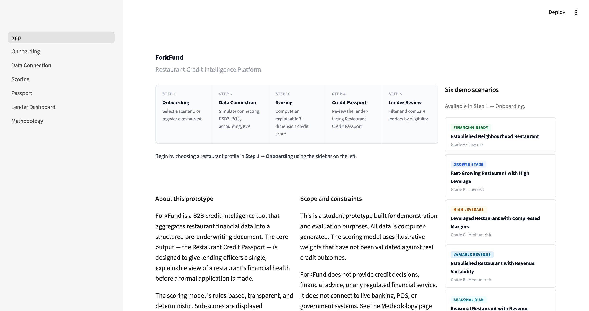
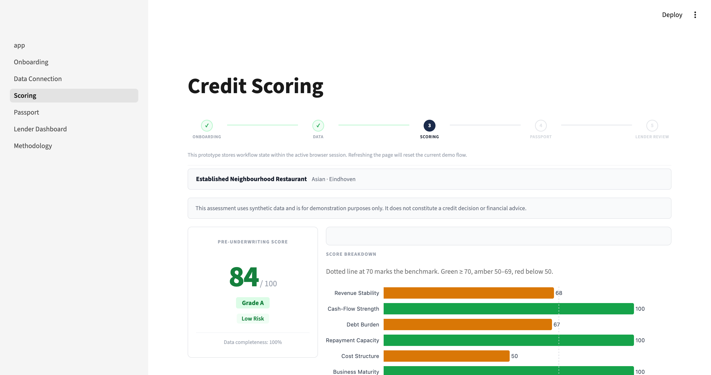
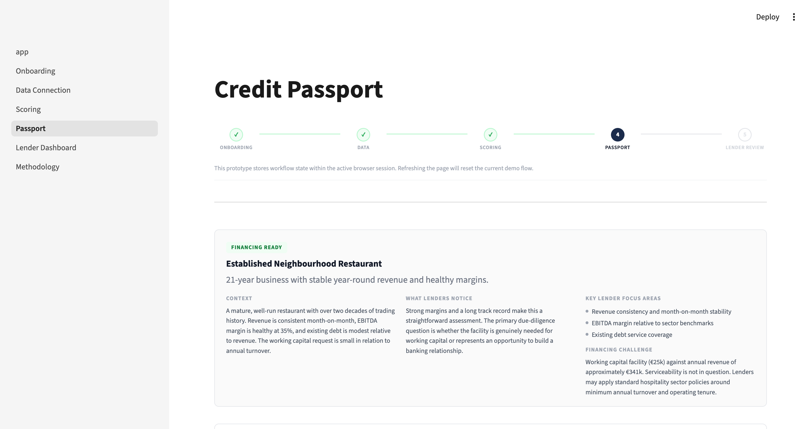
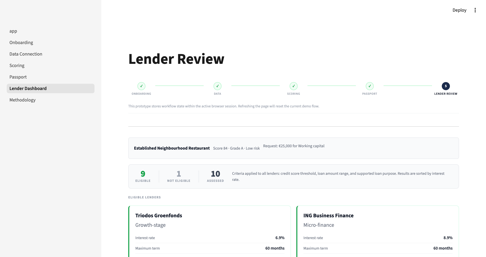
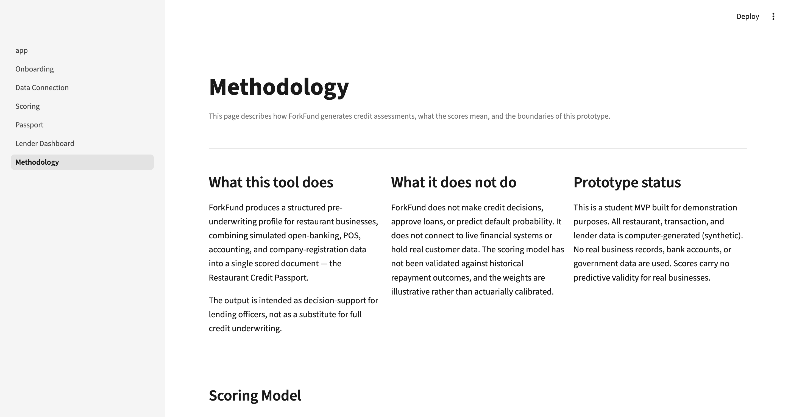

# ForkFund

**Restaurant Credit Passport Platform**

A rules-based credit-intelligence tool that aggregates simulated restaurant financial data
into a structured, explainable pre-underwriting document — the *Restaurant Credit Passport* —
for use by lending officers and financial institutions.

> Student FinTech MVP · Master's programme · Business Models & Applications  
> All data is computer-generated. This is not a real financial service or credit-assessment system.

---

## Problem

Restaurants seeking financing face a structural information asymmetry: their financial data
is distributed across bank accounts, point-of-sale systems, accounting platforms, and company
registries — with no standardised format that lenders can work from directly.

Lending officers either request large volumes of unstructured documents and interpret them
manually, or apply conservative heuristics that disadvantage businesses with limited paper
trails. The result is a slow, opaque, and inconsistent assessment process.

## Solution

ForkFund simulates a data aggregation and standardisation layer that:

1. Retrieves restaurant financial data from four source types: open banking (PSD2), point of
   sale (POS), accounting software, and the Dutch company registry (KvK).
2. Normalises it into a unified schema.
3. Computes a transparent, rules-based credit score across seven independently interpretable
   dimensions.
4. Assembles a *Restaurant Credit Passport* — a single lender-facing document that presents
   the score, explains each driver, flags material risks, and filters eligible financing options.

The scoring model is deterministic and fully explainable. Every sub-score is visible, every
positive and negative driver is labelled, and every risk flag is written in plain language.

## Scope

| ForkFund **is** | ForkFund **is not** |
|---|---|
| A pre-underwriting decision-support tool | An automated credit approval engine |
| An explainable, rules-based scoring platform | A machine learning or statistical model |
| A demonstration of open-finance data standardisation | A live banking or government integration |
| A structured document for lending officers | A regulated financial service or advice |

---

## Live Demo

**[→ Open in Streamlit Cloud](https://forkfund-credit-passport-fintech.streamlit.app/)**

No login required. Select any of the six pre-configured restaurant scenarios from
**Step 1 — Onboarding** to begin the full workflow.

---

## Screenshots

<table>
<tr>
<td colspan="2"></td>
</tr>
<tr>
<td colspan="2"><strong>Home</strong> — workflow overview, prototype scope, and six demo scenario cards</td>
</tr>
<tr><td colspan="2"><br></td></tr>
<tr>
<td width="50%"></td>
<td width="50%"></td>
</tr>
<tr>
<td><strong>Scoring</strong> — composite score (84 / Grade A), 7-dimension sub-score chart, dimension notes, risk flags</td>
<td><strong>Credit Passport</strong> — lender-facing document with context, lender notice, and financing challenge</td>
</tr>
<tr><td colspan="2"><br></td></tr>
<tr>
<td width="50%"></td>
<td width="50%"></td>
</tr>
<tr>
<td><strong>Lender Review</strong> — 9 of 10 lenders eligible for Grade A profile, ranked by interest rate</td>
<td><strong>Methodology</strong> — scoring model specification, known limitations, regulatory context</td>
</tr>
</table>

---

## User Flow

```
1. Onboarding        Select one of six curated restaurant profiles
        ↓
2. Data Connection   Simulate connecting PSD2, POS, accounting, and KvK sources
        ↓
3. Scoring           View the explainable credit score with sub-score breakdown
        ↓
4. Credit Passport   Review and download the complete lender-facing passport (JSON)
        ↓
5. Lender Review     Filter and compare eligible lenders by score, amount, and purpose
        ↓
6. Methodology       Understand the scoring model, data sources, and limitations
```

Session state is maintained across pages within a single browser session.
There is no persistence layer; state is lost on page refresh.

---

## Scoring Model

The composite score (0–100) is a weighted average of seven independently normalised dimensions.

| Dimension | Weight | Source | Method |
|---|---|---|---|
| Revenue stability | 20 % | POS | 1 − coefficient of variation of monthly net revenue |
| Cash-flow strength | 20 % | PSD2 | Net inflow margin normalised to a 30 % benchmark |
| Debt burden | 15 % | Accounting | 1 − (debt / revenue), floored at zero |
| Repayment capacity | 15 % | Accounting | EBITDA margin normalised to a 30 % benchmark |
| Cost structure | 10 % | Accounting | Cost ratio scaled between 45 % (efficient) and 85 % (unsustainable) |
| Business maturity | 10 % | KvK | Years since registration, capped at 10 |
| Data completeness | 10 % | All | Fraction of the four sources that are populated |

**Grade bands:** A (≥ 80) · B (65–79) · C (50–64) · D (35–49) · F (< 35)  
**Risk bands:** Low (≥ 70) · Medium (50–69) · High (30–49) · Very High (< 30)

Grades and risk bands are derived independently from the same composite score.
Full method definitions are in [docs/scoring_model.md](docs/scoring_model.md).

---

## Demo Scenarios

Six curated restaurant profiles are available in the Onboarding step.
Each illustrates a financing situation that lending officers regularly encounter.

| Scenario | Grade | Risk | Profile |
|---|---|---|---|
| Established Neighbourhood Restaurant | A | Low | 21-year business, stable revenue, healthy EBITDA, modest loan request |
| Fast-Growing Restaurant with High Leverage | B | Low | 4-year business, exceptional EBITDA, already-leveraged balance sheet |
| Leveraged Restaurant with Compressed Margins | C | Medium | 4-year business, high revenue, unsustainable cost structure and high debt |
| Established Restaurant with Revenue Variability | B | Medium | 9-year business, strong EBITDA, significant month-to-month revenue swings |
| Seasonal Restaurant with Revenue Variability | C | Medium | 26-year business, seasonal revenue gaps, moderate margins, elevated debt |
| Operationally Distressed Restaurant | C | Medium | 23-year business, near-zero EBITDA, three active risk flags |

---

## Architecture

ForkFund is a single-process Streamlit application with no external dependencies at runtime.
There is no database, no backend server, and no network calls.

```
Browser
  └── Streamlit  (app.py + pages/)
        └── src/
              ├── connectors/        reads data/synthetic/*.csv
              ├── standardization/   normalises to unified schema
              ├── scoring/           computes 7-dimension credit score
              ├── passport/          assembles Credit Passport dataclass
              ├── lender/            filters lenders.csv by eligibility
              ├── demo/              curated scenario definitions
              └── utils/             helpers and synthetic data generator
```

**Pipeline:**

```
data_generator.py → data/synthetic/*.csv
                           ↓
connectors → normalizer → engine → explainer → passport → lender filters
```

Business logic is strictly separated from the UI layer.
`src/` contains no Streamlit imports; `pages/` contains no scoring or normalisation logic.

Full design documentation: [docs/architecture.md](docs/architecture.md)

---

## Repository Structure

```
app.py                    Streamlit entry point and home page
pages/
  1_Onboarding.py         Scenario selection
  2_Data_Connection.py    Simulated data source consent flow
  3_Scoring.py            Score computation and visualisation
  4_Passport.py           Credit Passport display and JSON export
  5_Lender_Dashboard.py   Lender filtering and comparison
  6_Methodology.py        Scoring model and limitations reference
  components/             Shared UI components (charts, cards, styles)
src/
  connectors/             Simulated PSD2, POS, accounting, KvK loaders
  standardization/        Unified schema normaliser
  scoring/                Scoring engine (engine.py) and explainability (explainer.py)
  passport/               Credit Passport assembler and JSON serialiser
  lender/                 Lender filtering and ranking
  demo/                   Curated scenario definitions (no business logic)
  utils/                  Helpers and synthetic data generator
data/
  synthetic/              Pre-generated CSV files (committed to repository)
  schemas/                Unified schema specification and field glossary
docs/                     Architecture, data model, scoring model, user flow
tests/                    pytest unit tests for src/ modules (80 tests)
```

---

## Setup

Requires Python 3.11+.

```bash
# 1. Clone the repository
git clone <repo-url>
cd forkfund-mvp-Fintech-BAM

# 2. Create and activate a virtual environment
python -m venv venv
source venv/bin/activate        # Windows: venv\Scripts\activate

# 3. Install dependencies
pip install -r requirements.txt

# 4. Run the application
streamlit run app.py
```

Synthetic data is pre-generated and committed. The application runs immediately after step 4
without any data generation step.

**To regenerate the synthetic dataset from scratch:**

```bash
python -m src.utils.data_generator
```

This overwrites all files in `data/synthetic/` using a fixed random seed (42),
producing the same 120 restaurant profiles each time.

---

## Running Tests

```bash
pytest tests/
```

80 tests · covers all `src/` modules · no external dependencies · runs in under 2 seconds.

---

## Deployment

The application is deployed on Streamlit Cloud directly from this repository.

| Item | Detail |
|---|---|
| Platform | [Streamlit Community Cloud](https://streamlit.io/cloud) |
| Entry point | `app.py` |
| Python version | 3.11 |
| Dependencies | `requirements.txt` |
| Live URL | `https://forkfund-credit-passport-fintech.streamlit.app/` |

No environment variables or secrets are required. The application uses only committed
CSV files and has no external API calls.

**To deploy your own instance:**
1. Fork this repository.
2. Log in to [share.streamlit.io](https://share.streamlit.io).
3. Create a new app, point it at `app.py`, and deploy.

---

## Limitations

**Model validity.** Score weights are illustrative starting values. They were not derived
from historical default or repayment data and have not been backtested against real outcomes.

**Single accounting year.** The scoring engine uses only the most recent accounting year for
debt burden, repayment capacity, and cost structure. A production implementation would
incorporate multi-year trend analysis.

**No seasonality detection.** Revenue variability is measured as a coefficient of variation
across monthly figures. The model does not distinguish between predictable seasonal patterns
and structural volatility.

**Session persistence.** State is held in the browser session only and is lost on page
refresh. There is no database or persistence layer.

**Lender dataset.** Ten fictional lenders covering a limited range of criteria. Distressed
profiles will correctly return zero eligible matches — this reflects the profile, not a defect.

A full discussion of limitations and the applicable regulatory framework (GDPR, PSD2, EU AI Act)
is available on the **Methodology** page within the application.

---

## Tech Stack

| Layer | Technology |
|---|---|
| UI | Streamlit 1.57 (multi-page application) |
| Business logic | Python 3.11+ |
| Data manipulation | pandas 3.0, numpy 2.4 |
| Visualisation | plotly 6.7 |
| Storage | Local CSV files (no database) |
| Tests | pytest 9.0 |

---

## Disclaimer

ForkFund is a student prototype built for educational and demonstration purposes.
All restaurant, transaction, and lender data is computer-generated (synthetic).
It does not constitute financial advice, a credit decision, or any regulated financial service.
It is not connected to any real banking, point-of-sale, or government data system.
Scores carry no predictive validity for real businesses.
